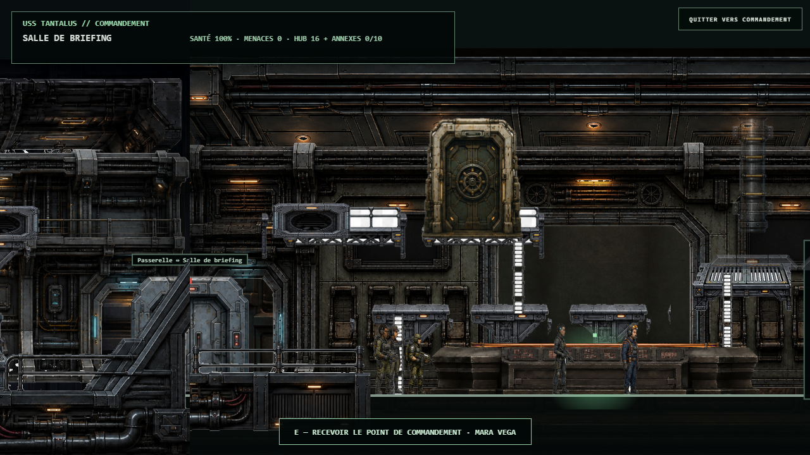
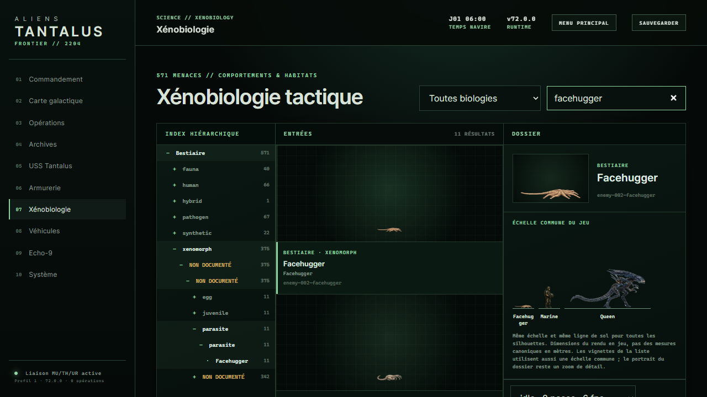
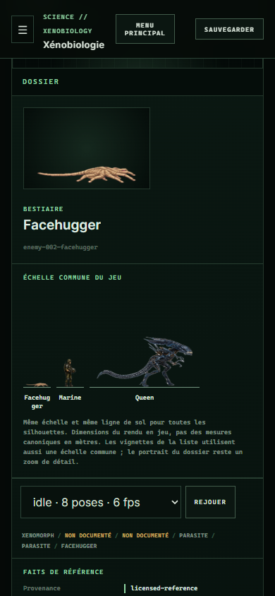

# Validation V72

Date : 5 septembre 2026. Cette livraison corrige des défauts précis ; elle ne déclare pas tous les contenus ni le jeu commercial achevés. Voir [audit global](AUDIT_GLOBAL_V72.md).

## Contrôles exécutés

- Suite globale finale après navigation mobile :989tests,988réussis,0échec,1ignoré ;23,6secondes. Lint :286modules valides. Build72.0.0 :3450entrées catalogue.
- Après retouche de navigation mobile :17tests catalogue/échelle/PWA réussis et build réussi.
- Manifest V64 synchronisé :195atlases/2772cellules. Complément V65/V66 :6atlases/192poses.
- Queue de production vérifiée sans erreur ; aucune promotion ennemie induite par les candidats V72.
- Nouvelle table : `py -3 scripts/process-hub-table-v72.py --check` réussi, hashes/reconstruction identiques, zéro pixel blanc opaque et zéro pixel magenta strict résiduel.
- Sources et candidats V72 exclus du build et du déploiement ; WebP de table runtime inclus.
- Aucun message d'erreur JavaScript relevé dans la session navigateur `atf-v72` pendant le parcours inspecté.

## Parcours visuel de cette session

1. Accueil : ouverture fonctionnelle puis entrée dans le hub. État général correct sur cette étape ; ne prouve pas une campagne complète.
2. Salle de briefing : approche préparée via l'API QA du moteur local. Table2D entière, indépendante, sans fond blanc et sur le sol des acteurs. Certaines anciennes perspectives de décor restent à revoir.
3. Bestiaire1280×720 : recherche Facehugger, portrait à ratio natif et comparaison simultanée facehugger/marine/reine. Les dimensions sont celles du jeu, pas une invention de mètres canoniques.
4. Bestiaire390×844 : aucune largeur excédentaire ; sélection mène au dossier sous l'en-tête ; trois silhouettes et commandes d'animation visibles. Risque restant : petits textes secondaires, accessibilité complète non certifiée.

Captures exactes sauvegardées et inspectées, dans `references/v72-audit/` :

Les régressions gameplay/narratives et36plans d'arène sont testés automatiquement. Aucune prétention de playthrough humain de toutes les campagnes, de durée de vie mesurée, de multijoueur serveur certifié ou de fidélité artistique1:1.

## Publication

En attente de l'identifiant de commit et de la confirmation Vercel ; un build local ne vaut pas une mise en ligne.
