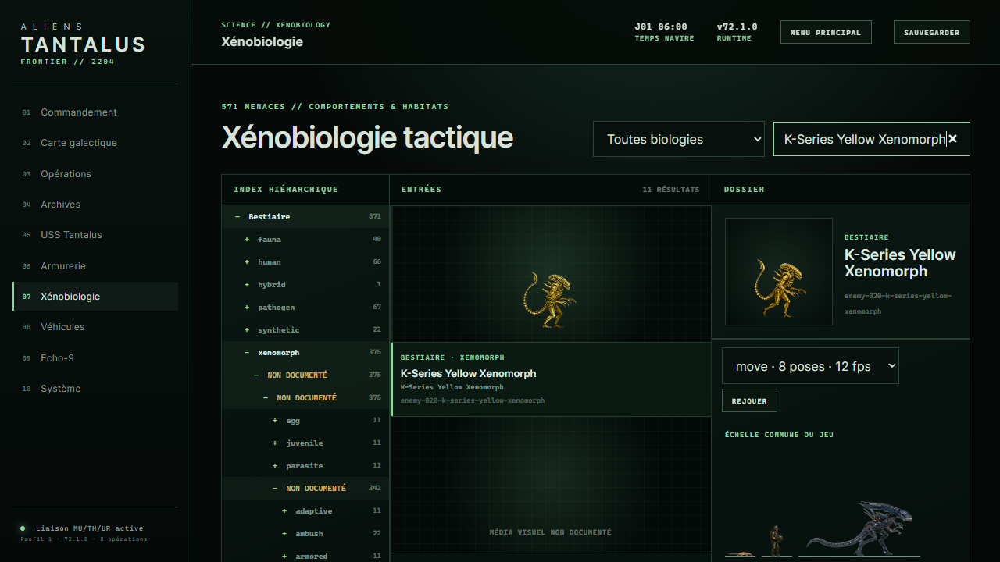

# Validation et publication V72.1

5 septembre 2026. Cette livraison est publiée ; l'objectif global « tous les ennemis sans placeholder » reste ouvert.

## Résultat livré

- K-Series Yellow Xenomorph020 : atlas dédié accepté de 32 poses, quatre animations, corps physique de 62 × 136 unités, points d'appui et échelle inter-clips contrôlés. L'attaque applique un seul impact à la pose prévue. Identité conservée pendant toute l'animation.
- Bestiaire : commandes de lecture immédiatement sous le portrait. Comparateur conservant l'échelle relative des créatures.
- Albino Red071 et Albino K-Series072 : huit nouvelles planches OpenAI, soit 64 poses candidates ; deux essais supplémentaires rejetés sont conservés. Les courses restent refusées et ces deux profils ne sont pas intégrés.
- Combat Synthetic042 : cinq sources existantes conditionnées en candidat de 40 poses ; validation artistique et physique encore incomplète.

Le [rapport de production](ENEMY_PRODUCTION_V72.md) précise les lacunes. Le complément V65/V66 comporte maintenant 7 atlas intégrés et 224 poses, pas 571 ennemis intégralement finalisés. La file de production atteste 220 planches sur 2 457 requises ; les 2 237 restantes ne sont pas présentées comme produites. Les anciennes animations de famille demeurent dans le jeu.

## Publication effectivement contrôlée

- URL : [ALIENS: TANTALUS FRONTIER](https://aliens-tantalus-frontier.vercel.app).
- Cible : production, statut Vercel **Ready**.
- Déploiement : `dpl_3JEhLHxDbZdbjpZRkoitzg8SqvgR`.
- URL immuable : https://aliens-tantalus-frontier-5mnw0qvt0-darknigthmares-projects.vercel.app.
- Commit applicatif : `c77dad0`. Commit de publication : `0feded4`, ajoutant uniquement la préservation des octets de quatre reçus historiques.
- Branche poussée : `codex/v52-physical-worlds`, dépôt privé `darknigthmare/aliens-tantalus-frontier`. La branche `main` n'a pas été écrasée.
- Application JavaScript statique ; build distant réussi en 10 secondes. Version servie `72.1.0`, construction `2026-09-05T16:37:02.689Z`.

À 16:38:38 UTC, `/`, `build-info.json`, le registre runtime et `sw.js` répondent HTTP 200. Le cache attendu `atf-v72-enemy-020-shell-2` est présent. L'atlas020 répond HTTP 200 et son SHA-256 est exactement :

```text
9e6b65302b32fe8c7448cf4f0bd1a8ff23eefc9e9004043c556be33e8bb6d3f6
```

Les atlas candidats042/071/072 et le master PNG071 interrogés répondent HTTP 404, conformément à leur exclusion. [Résultats HTTP exacts](references/v72-k-series-020-review/production-http.json).

## Contrôles de livraison

La copie Git propre a révélé quatre reçus historiques dont Git transformait les fins de ligne CRLF en LF. Les données JSON étaient identiques, mais les empreintes ne l'étaient pas. Le commit `0feded4` conserve désormais leurs octets d'origine avec quatre exceptions `-text` ciblées ; aucune empreinte historique ni image source n'a été réécrite pour contourner la vérification.

Dans le worktree de publication : vérification de la file de production réussie, manifeste complémentaire synchronisé et normalisation020 reproductible sans anomalie.

La relance globale sur la copie propre a aussi détecté une assertion de publication obsolète : elle attendait les cinq atlas du lot001 malgré l'ajout explicite de020 à `.vercelignore`. Le test a été corrigé pour exiger exactement ces six atlas V66 et refuser explicitement042/071/072. Il n'y a pas de changement applicatif après le commit publié.

Dernière suite complète après cette correction :

```text
tests 999
pass 998
fail 0
cancelled 0
skipped 1
todo 0
duration_ms 17017.2237
```

Le test ignoré dépend des droits de création de liens symboliques. Lint : 286 modules valides. Les preuves d'intégration historiques restent inchangées ; ce rapport complète, sans remplacer, le journal de recette précédent.

## Navigateur de production

Parcours réellement effectué par les commandes visibles : écran titre, Continuer, hub, retour au commandement, Xénobiologie, recherche K-Series. Le sélecteur d'animation fonctionne sur le site publié.

À 1 280 × 720, le contrôle DOM a observé les 32 cellules réparties entre idle, move, attack et death. Toutes chargent le même atlas020, de largeur native 1 024 pixels. La mort se fige bien sur la cellule31. Le sélecteur reste à y = 445,47 pixels, sous le portrait. Aucun message d'erreur JavaScript relevé dans cette session. [Mesures exactes](references/v72-k-series-020-review/production-browser.json).



Le combat a été vérifié séparément dans le vrai moteur local avec une fixture isolée et une sauvegarde inchangée : déplacement, pieds alignés, orientation vers la cible, impact unique de 30 PV. Il ne s'agit pas d'une campagne entière jouée en production.

## Observabilité et limites

`vercel logs --level error --since 1h` : aucun journal trouvé. Ce constat ponctuel ne prouve pas l'absence de tous les bugs clients d'une application statique. Aucun monitoring récurrent n'a été créé ; les drains n'ont pas été inventoriés.

Les contrôles ci-dessus ne certifient ni une fidélité pixel pour pixel, ni toute la durée de vie, ni tous les scénarios multijoueurs. Les adaptations restent `canonExact:false`. Les candidats rejetés, les 19 normalisations du lot002 à reprendre après modification des registres partagés et le reste du roster sont explicitement hors de l'acceptation de cette livraison.
